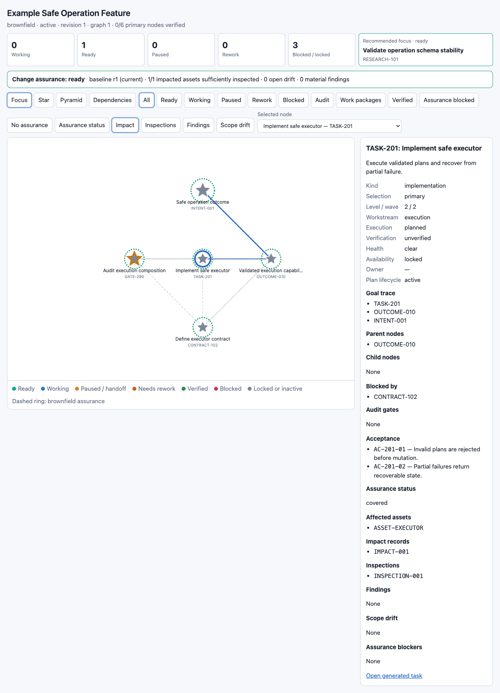
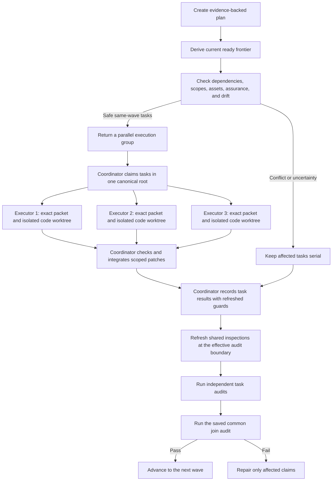

# Pyramid Task

[](https://github.com/KMerdan/pyramid-task/actions/workflows/ci.yml)
[](LICENSE)
[](https://www.python.org/)
[](https://developers.openai.com/codex/)

Pyramid Task turns a software intent into an evidence-backed execution graph. In an existing repository, it also maintains a change-assurance case: what exists, what a task may affect, which evidence remains fresh, and whether the completed branches actually establish the intended outcome.

Version 3.5.0 adds derived conflict-safe parallel batches and a host-neutral orchestration skill. Workers receive task-scoped context, auditors receive audit-scoped context, and the global graph version remains an ordering mechanism instead of becoming a false dependency between unrelated work. The same `main` branch supports Codex and Claude Code.



## What it solves

A flat task list can say what to do without proving that:

- the proposed work connects to an observable final outcome;
- parallel branches compose safely;
- a brownfield system was inspected at the right boundary;
- an inspection still covers the implementation that now exists;
- generated files and evidence reports are distinguished from product changes;
- a worker resumes with the exact task context it previously held;
- concurrent activity is relevant before it is treated as a conflict.

Pyramid Task models these concerns explicitly. It keeps execution, verification, health, availability, lifecycle, and assurance separate, then derives the next safe action from their combination.

## Current architecture

| Layer | Canonical purpose | Agent-loading behavior |
| --- | --- | --- |
| `.pyramid/plan.json` | Current intent, graph topology, contracts, and evidence ledger | Selected node and goal trace only |
| `.pyramid/state.json` | Current execution, verification, health, ownership, and lifecycle | Selected state and direct dependencies only |
| `.pyramid/project.json` | Project format and greenfield/brownfield mode | Loaded when mode or migration matters |
| `.pyramid/baseline.json` | Current system assets, relations, history, and unknowns | Relevant baseline and impact slice only |
| `.pyramid/assurance.json` | Impacts, inspections, findings, drift, and controls | Relevant task or audit slice only |
| `.pyramid/events/*.json` | One immutable, hash-linked event per mutation | Not injected into normal prompts; query a bounded `diff` |
| `.pyramid/handoffs/` | Durable pause and resume evidence | Loaded only for the active handoff |
| `.pyramid/head.json` | Atomic identity of the committed canonical state | Used to validate publication and context |
| Graph, ready, Markdown, and HTML files | Human and machine-readable projections | Regenerated; never mutation inputs |

The event history is not a Git object database or a growing version array inside one JSON document. Events may contain before/after evidence, but each mutation is a separate immutable file. Normal agent packets do not include that history. `diff` returns compact changed-field summaries by default and includes full values only with `--detail`.

## Exact context at the mutation boundary

Pyramid Task uses two concurrency scopes:

| Mutation | Context to use | Why |
| --- | --- | --- |
| `take`, `update`, `pause` for a selected task | `mutation_guards.task` | Binds the task contract, its state and dependencies, baseline, and relevant impacts |
| `audit` | `mutation_guards.audit` from `inspect --audit-readiness` | Binds covered claims, implementation frontier, and relevant assurance |
| `resume` | Canonical handoff hashes and reported drift | Protects paused graph, assurance, and worktree context |
| `impact`, `assess`, topology, lifecycle, reset, and restore | `context.graph_version` plus `context.id` | These operations intentionally affect shared canonical state |

An unrelated inspection refresh may advance the global event sequence without invalidating a worker packet. A relevant task, dependency, baseline, impact, implementation, or inspection change still invalidates the corresponding scoped guard. On conflict, refresh only that task or audit packet.

```bash
# Find work without loading every task in full.
python3 plugins/pyramid-task/scripts/pyramid.py inspect \
  --project /path/to/project --ready --json

# Claim the selected task using its task guard.
python3 plugins/pyramid-task/scripts/pyramid.py take \
  --project /path/to/project --node TASK-203 --actor worker \
  --expected-guard <task-guard> --json

# Submit implementation with the refreshed task guard returned by take.
python3 plugins/pyramid-task/scripts/pyramid.py update \
  --project /path/to/project --node TASK-203 --actor worker \
  --status implemented --result result.json \
  --expected-guard <task-guard> --json

# Load the exact audit blockers and audit guard immediately before audit.
python3 plugins/pyramid-task/scripts/pyramid.py inspect \
  --project /path/to/project --audit-readiness GATE-205 --json
```

## Parallel execution with sub-agents

Pyramid now derives parallel groups from the live ready frontier. It does not add another mutable scheduler file or store group snapshots in the graph. A task can join a group only when it is in the same execution wave and the runtime finds no dependency, write/evidence/generated-output, asset, inspection-policy, broad-scope, or open-drift conflict.

`level` is distance from the intent. `wave` is earliest safe execution time. Tasks at the same level are not automatically independent, and same-wave tasks still need conflict analysis.



The deterministic runtime recommends the group; the host agent owns sub-agent creation. One coordinator owns the authoritative `.pyramid`, claims tasks, integrates patches, records updates, refreshes assurance, and runs audits. Source-writing executors use separate code worktrees and never mutate worktree-local Pyramid state. Their prompts contain only the exact claimed packet—not the full graph or event history. If isolated workspaces or safe integration are unavailable, source work stays serial.

```bash
python3 plugins/pyramid-task/scripts/pyramid.py inspect \
  --project /path/to/project --parallel-ready --max-agents 4 --json
```

The response identifies safe groups, claim guards, isolation mode, per-inspection planned refresh policies, the effective boundary required by audit freshness, a common join gate, and reasons each remaining task must stay serial. Groups are ordered by earliest wave, highest slot use, then stable ID. Save the selected join metadata, because implemented tasks leave the ready frontier; re-run the query after the batch audits finish.

Read the [parallel execution contract](plugins/pyramid-task/references/parallel-execution.md) for worker prompt and safety rules.

## Assurance at the right time

For brownfield work, each performed inspection can record the exact latest `task.implemented` event it validated. Readiness and audit use the same freshness engine, so the summary cannot say “ready” while the audit would reject older inspection evidence.

`inspect --audit-readiness` returns:

- structural and assurance blockers for that target;
- the covered task IDs;
- the audit-scoped mutation guard;
- the minimal `refresh_inspection_ids` set.

Refresh only those inspections at their planned wave, pre-audit, or release boundary. `refresh_policy` documents the intended batching boundary; it does not waive freshness at audit time.

Implementation results distinguish these change classes:

- `source`, `runtime`, and `configuration` for authored product behavior;
- `generated` for declared build output mapped to real baseline assets;
- `evidence` for artifacts inside an explicit evidence-output scope;
- `unknown` for changes that need conservative review.

Evidence-only artifacts do not create product scope drift or stale product inspections by default. Generated output avoids false drift only when its path pattern and existing asset IDs were declared in the task contract; it still invalidates inspections covering the generated behavior. Baseline `exclude_locators` and inspection `invalidated_by` rules provide narrower control without weakening unknown-scope handling.

Impact preview hashes exclude publication metadata, so previewing unchanged semantic content returns the same candidate hash. Apply recomputes the candidate under the project lock.

Read the [brownfield assurance contract](plugins/pyramid-task/references/brownfield-assurance.md) for the complete evidence and invalidation rules.

## Live visualization

The browser graph provides focus, star, pyramid, and dependency views with task state, handoffs, assurance, assets, inspections, findings, drift, blockers, and publication health.

```bash
python3 plugins/pyramid-task/scripts/pyramid.py visualize \
  --project /path/to/project --live --open --json
```

Live mode serves only on loopback. The default watcher checks for a validated atomic graph publication every 250 milliseconds and rerenders only when the slim visualization payload changes semantically. Raw canonical writes are never broadcast. If compilation lags or a publication fails validation, the browser retains the last valid graph and reports publication health rather than presenting partial state.

Static visualization remains self-contained for archives and sharing:

```bash
python3 plugins/pyramid-task/scripts/pyramid.py visualize \
  --project /path/to/project --output /path/to/pyramid.html --json
```

## Install

Requirements: Codex or Claude Code with plugin support, plus Python 3.10 or newer.

### Codex

```bash
codex plugin marketplace add KMerdan/pyramid-task
codex plugin add pyramid-task@kmerdan-skills
```

Update an existing installation:

```bash
codex plugin marketplace upgrade kmerdan-skills
codex plugin add pyramid-task@kmerdan-skills
```

### Claude Code

The same `main` branch contains both runtime manifests:

```bash
git clone https://github.com/KMerdan/pyramid-task
claude plugin marketplace add ./pyramid-task
claude plugin install pyramid-task@kmerdan-skills
```

Start a new agent session after installation or update so the runtime discovers the current skills.

## Recommended workflow

1. Create the intent graph. Existing repositories default to brownfield mode.
2. Assess the system baseline and map change impact before relying on brownfield audits.
3. Inspect the compact ready frontier; derive one conflict-safe parallel group when multiple agent slots are available.
4. Claim each selected task with its scoped guard and give every worker only its exact packet.
5. Report implementation with actual files, assets, checks, evidence, and typed change effects.
6. Refresh shared inspections once at the returned batch boundary.
7. Audit implementation nodes and the common composition gate independently.
8. Close only after the intent and assurance case pass, then archive or start a new intent.

Natural-language entry points:

```text
Use $pyramid-task:create to turn this feature request into an evidence-backed implementation plan.
Use $pyramid-task:assess to baseline this existing system.
Use $pyramid-task:impact to map affected assets and required inspections.
Use $pyramid-task:inspect to show the ready frontier or audit readiness.
Use $pyramid-task:orchestrate to run one conflict-safe ready batch with sub-agents.
Use $pyramid-task:take to claim the next safe task.
Use $pyramid-task:update to record implementation and actual change scope.
Use $pyramid-task:audit to verify a task, composition gate, outcome, or intent.
Use $pyramid-task:pause and $pyramid-task:resume for a durable handoff.
Use $pyramid-task:visualize to open the live execution and assurance graph.
Use $pyramid-task:lifecycle to close, archive, reset, or restore a plan.
```

Create directly through the deterministic runtime:

```bash
python3 plugins/pyramid-task/scripts/pyramid.py create \
  --project /path/to/project \
  --plan plugins/pyramid-task/assets/example-plan.json \
  --actor planner --mode auto --json
```

For a reviewed brownfield plan, include the baseline and assurance candidates:

```bash
python3 plugins/pyramid-task/scripts/pyramid.py create \
  --project /path/to/project --plan plan.json --actor planner --mode auto \
  --baseline baseline.json --assurance assurance.json --json
```

If the baseline is not known, creation writes a deliberately incomplete placeholder. Bounded discovery can begin, but brownfield audits cannot pass until `assess` and `impact` establish sufficient evidence.

## Included skills

| Skill | Purpose |
| --- | --- |
| `pyramid-task:create` | Clarify intent, gather evidence, compare paths, and create the first graph. |
| `pyramid-task:new-intent` | Safely route a distinct intent through create, upgrade, archive, and reset. |
| `pyramid-task:assess` | Establish or refresh the existing-system baseline. |
| `pyramid-task:impact` | Map affected assets, inspections, findings, drift, and controls. |
| `pyramid-task:upgrade` | Upgrade an active V2/V2.1 project in place without rebuilding its graph. |
| `pyramid-task:inspect` | Query compact status, readiness, blockers, audit freshness, and traces. |
| `pyramid-task:orchestrate` | Derive and coordinate one conflict-safe task batch with sub-agents. |
| `pyramid-task:take` | Claim one ready or rework task and receive its scoped packet. |
| `pyramid-task:pause` | Pause owned work with an immutable evidence-aware handoff. |
| `pyramid-task:resume` | Validate and resume the canonical handoff with a fresh lease. |
| `pyramid-task:update` | Record implementation, evidence, actual scope, blockers, and risk. |
| `pyramid-task:audit` | Verify tasks, branch composition, outcomes, and the final intent. |
| `pyramid-task:expand` | Add an approved subtree while preserving the parent contract. |
| `pyramid-task:replan` | Revise invalid topology while preserving valid work and history. |
| `pyramid-task:lifecycle` | Reopen, close, archive, reset, clean, and restore plans. |
| `pyramid-task:visualize` | Render a snapshot or live interactive execution graph. |

## Lifecycle, expansion, and compatibility

Implementation is not verification. A brownfield intent is complete only after primary claims pass independent audits, assurance has no blockers, and `close` writes the final report and change dossier. The verified changed baseline is then carried into the next planning cycle.

Use `pause` for an interruption, `expand` when a valid task contract needs multiple internal work units, and `replan` when evidence changes the contract or selected path. All topology and lifecycle changes preserve history and use explicit preview or evidence boundaries.

Use `new-intent` for the next distinct outcome. It chooses the safe create, upgrade/archive/reset, archive/reset, or blocked route from actual project state and binds an existing-project transition to one approval hash.

Legacy projects without `.pyramid/project.json` remain readable and can upgrade in place. Older standalone `pyramid-task-planner` installations should be replaced by the compatibility router in `compat/pyramid-task-planner`; `doctor --json` reports the conflict.

Detailed contracts:

- [Graph and state](plugins/pyramid-task/references/graph-contract.md)
- [Agent and audit packets](plugins/pyramid-task/references/agent-contracts.md)
- [Parallel execution](plugins/pyramid-task/references/parallel-execution.md)
- [Brownfield assurance](plugins/pyramid-task/references/brownfield-assurance.md)
- [Visualization](plugins/pyramid-task/references/visualization-contract.md)
- [Pause and resume](plugins/pyramid-task/references/handoff-contract.md)
- [Lifecycle](plugins/pyramid-task/references/lifecycle-contract.md)
- [Expansion](plugins/pyramid-task/references/expansion-contract.md)
- [Upgrade](plugins/pyramid-task/references/upgrade-contract.md)
- [New intent](plugins/pyramid-task/references/new-intent-contract.md)

## State model

- Execution: `planned`, `working`, `paused`, `implemented`, `needs-rework`, `superseded`
- Verification: `unverified`, `pending`, `passed`, `failed`
- Health: `clear`, `at-risk`, `blocked`
- Plan lifecycle: `active`, `completed`, `archived`
- Assurance: `incomplete`, `ready`, `stale`, `passed`

Availability is derived from these dimensions and graph dependencies; agents do not write it directly.

## Repository layout

```text
.agents/plugins/marketplace.json        Public marketplace definition
plugins/pyramid-task/
├── .codex-plugin/plugin.json          Codex manifest
├── .claude-plugin/plugin.json         Claude Code manifest
├── skills/                            Sixteen agent-facing interfaces
├── scripts/
│   ├── pyramid.py                     Thin command-line adapter
│   ├── pyramid_core.py                Transaction and compatibility facade
│   ├── pyramid_graph.py               Pure graph and readiness primitives
│   ├── pyramid_parallel.py            Pure parallel-frontier analysis
│   ├── pyramid_assurance.py           Assurance domain rules
│   ├── pyramid_live.py                Validated loopback live server
│   └── pyramid_visualizer.py          Static interactive renderer
├── schemas/                           Published JSON contracts
├── references/                        Graph, assurance, agent, and lifecycle contracts
├── assets/                            Valid plan, baseline, assurance, expansion, and handoff examples
└── tests/                              Runtime and visualization regression tests
tools/validate_repository.py           Repository-level contract validation
```

## Development

```bash
python3 -m venv .venv
source .venv/bin/activate
python3 -m pip install -r requirements-dev.txt
make check
```

See [CONTRIBUTING.md](CONTRIBUTING.md) for design invariants and review expectations. Security issues should follow [SECURITY.md](SECURITY.md). Release changes are recorded in [CHANGELOG.md](CHANGELOG.md).

Maintainers can read [docs/architecture.md](docs/architecture.md) for module boundaries and the incremental plan for reducing `pyramid_core.py` without a compatibility-breaking rewrite.

## License

MIT © 2026 Dr. Merdan Bay. See [LICENSE](LICENSE).

Pyramid Task is an independent open-source project and is not affiliated with or endorsed by OpenAI.
