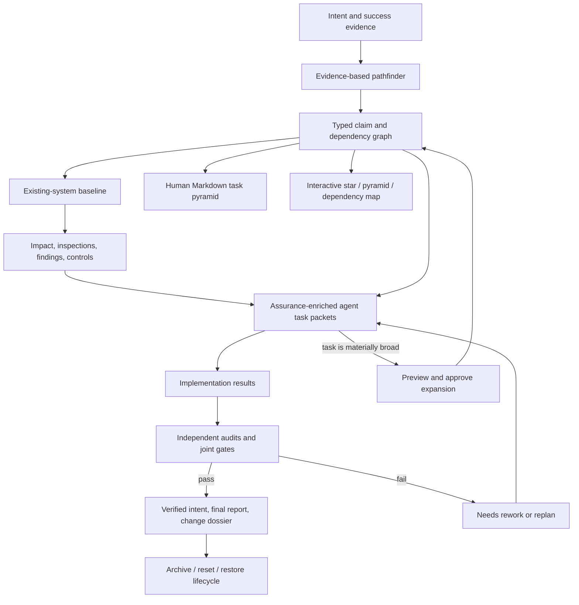

# Pyramid Task

[](https://github.com/KMerdan/pyramid-task/actions/workflows/ci.yml)
[](LICENSE)
[](https://www.python.org/)
[](https://developers.openai.com/codex/)

Pyramid Task V3 turns a software intent into an evidence-backed pathfinder graph and, for an existing system, an evidence-backed change-assurance case. It baselines what exists, maps predicted impact to tasks, requires sufficient inspections, detects actual scope drift, and carries the verified changed baseline into the next planning cycle.

It is designed for AI agents without sacrificing human legibility: agents receive compact structured task packets, while people get generated Markdown and an interactive star, pyramid, and dependency map.


## Why this exists

A flat task list says what to do. It usually does not prove that the work composes into the intended outcome—or that an existing system was inspected deeply enough to change safely.

Pyramid Task treats planning as a claim-and-evidence problem:

- clarify the final intent into observable success evidence;
- research the current system and record facts, assumptions, and contradictions;
- backward-chain from the outcome and forward-chain from the repository;
- compare feasible paths before selecting one;
- separate hierarchy (`level`) from safe execution order (`wave`);
- require joint audits where parallel branches compose;
- keep execution, verification, health, availability, and plan lifecycle distinct;
- preserve immutable events, failed evidence, superseded paths, and archives;
- inventory affected assets, dependencies, owners, history, and unknowns;
- compare predicted impact with actual changed files and assets;
- require inspection sufficiency, rollback, monitoring, and accountable finding disposition;
- emit a close-out change dossier and advance the system baseline.

## Included skills

| Skill | Purpose |
| --- | --- |
| `pyramid-task:create` | Clarify intent, gather evidence, compare paths, and create the graph. |
| `pyramid-task:assess` | Establish or refresh the existing-system baseline. |
| `pyramid-task:impact` | Map affected assets, inspections, findings, drift, and controls. |
| `pyramid-task:upgrade` | Migrate a running V2/V2.1 plan in place without rebuilding it. |
| `pyramid-task:inspect` | Query status, readiness, blockers, audits, and goal traces. |
| `pyramid-task:take` | Claim one safe ready or rework task and receive an agent packet. |
| `pyramid-task:update` | Record implementation results, evidence, blockers, and risk. |
| `pyramid-task:audit` | Verify tasks, branch joints, outcomes, and the final intent. |
| `pyramid-task:expand` | Propose a deeper subtree and apply it only after explicit user approval. |
| `pyramid-task:replan` | Revise invalid topology while preserving valid work and history. |
| `pyramid-task:lifecycle` | Reopen, close, archive, reset, clean, and restore plans safely. |
| `pyramid-task:visualize` | Render a self-contained interactive browser graph. |

## How it fits together



The canonical plan lives in `.pyramid/plan.json`. V3 adds a project manifest and, in brownfield mode, separate baseline and assurance companions. Keeping these contracts separate lets an active V2 plan upgrade without graph reconstruction. Graph snapshots, ready indexes, Markdown, and HTML remain generated projections—not mutation interfaces.

## Install

Requirements: Codex with plugin support and Python 3.10 or newer.

```bash
codex plugin marketplace add KMerdan/pyramid-task
codex plugin add pyramid-task@kmerdan-skills
```

Start a new Codex task after installation so the skills are discovered.

To update later:

```bash
codex plugin marketplace upgrade kmerdan-skills
codex plugin add pyramid-task@kmerdan-skills
```

## Use

Natural-language examples:

```text
Use $pyramid-task:create to turn this feature request into an evidence-backed implementation plan.
Use $pyramid-task:assess to baseline this existing software system before planning the change.
Use $pyramid-task:impact to map affected assets and required inspections for this plan.
Use $pyramid-task:upgrade to migrate this running V2.1 plan to V3 without rebuilding it.
Use $pyramid-task:inspect to show what is ready, blocked, working, and still unaudited.
Use $pyramid-task:take to claim the next safe task for this agent.
Use $pyramid-task:expand when this task is materially broad and needs an approved subtree.
Use $pyramid-task:visualize to render the current task graph.
Use $pyramid-task:lifecycle to close and archive this fully verified plan.
```

The deterministic runtime is also available directly:

```bash
python3 plugins/pyramid-task/scripts/pyramid.py --help
python3 plugins/pyramid-task/scripts/pyramid.py create \
  --project /path/to/project \
  --plan plugins/pyramid-task/assets/example-plan.json \
  --actor planner \
  --mode auto \
  --json
```

Common lifecycle commands:

```bash
python3 plugins/pyramid-task/scripts/pyramid.py lifecycle --project /path/to/project --json
python3 plugins/pyramid-task/scripts/pyramid.py close --project /path/to/project --actor owner --json
python3 plugins/pyramid-task/scripts/pyramid.py archive --project /path/to/project --actor owner --reason "Release complete" --json
```

Run `--help` on any command for the complete interface.

Brownfield creation is the default for a non-empty repository. Supply reviewed candidates when available:

```bash
python3 plugins/pyramid-task/scripts/pyramid.py create --project /path/to/project --plan plan.json --actor planner --mode auto --baseline baseline.json --assurance assurance.json --json
python3 plugins/pyramid-task/scripts/pyramid.py inspect --project /path/to/project --assurance --json
```

If the baseline is not yet known, creation writes a deliberately incomplete placeholder. Agents can start bounded discovery, but brownfield audits cannot pass until `assess` and `impact` establish sufficient evidence.

## Upgrade a running V2.1 plan

Upgrade is explicit, previewed, approval-bound, and idempotent. It preserves `plan.json` byte-for-byte, every node state, active ownership and lease, results, audits, lifecycle data, and prior events. It creates a validated pre-upgrade snapshot before adding V3 companions.

```bash
python3 plugins/pyramid-task/scripts/pyramid.py upgrade --project /path/to/project --actor migrator --from-version 2.1 --mode auto --preview --json
python3 plugins/pyramid-task/scripts/pyramid.py upgrade --project /path/to/project --actor migrator --from-version 2.1 --mode auto --approved-by owner --approval-reference task-message --approved-upgrade-sha256 <preview-hash> --apply --expected-version <graph-version> --json
```

Previously verified nodes stay verified; no work is replayed. Derived legacy inspections remain partial, so future audits and final closure must address the reported bridge gaps.

Expansion is deliberately two-phase:

```bash
python3 plugins/pyramid-task/scripts/pyramid.py expand --project /path/to/project --proposal expansion.json --actor planner --preview --json
python3 plugins/pyramid-task/scripts/pyramid.py expand --project /path/to/project --proposal expansion.json --actor planner --approved-by user --approval-reference task-message --approved-proposal-sha256 <preview-hash> --apply --json
```

The agent recommends expansion only from concrete scope evidence. The user approves the exact previewed topology. The stable parent ID becomes a non-executable work-package, and a mandatory joint audit covers every new branch.

## State model

Node state is intentionally multidimensional:

- Execution: `planned`, `working`, `implemented`, `needs-rework`, `superseded`
- Verification: `unverified`, `pending`, `passed`, `failed`
- Health: `clear`, `at-risk`, `blocked`
- Plan lifecycle: `active`, `completed`, `archived`
- Assurance: `incomplete`, `ready`, `stale`, `passed`

An implementation is not verified merely because an agent marked it implemented. In brownfield mode, an audit also needs canonical impact and sufficient inspection coverage. An intent is not complete until its evidence exists, required branches and gates pass, assurance has no blockers, and the plan is formally closed.

## Repository layout

```text
.agents/plugins/marketplace.json        Public Codex marketplace
plugins/pyramid-task/
├── .codex-plugin/plugin.json          Plugin manifest
├── skills/                            Twelve agent-facing interfaces
├── scripts/                           Deterministic runtime and visualizer
├── schemas/                           Published JSON contracts
├── references/                        Graph, evidence, agent, and lifecycle contracts
├── assets/                            Valid plan and expansion examples
└── tests/                              Runtime and visualization tests
tools/validate_repository.py           Self-contained repository validation
```

## Development

```bash
python3 -m venv .venv
source .venv/bin/activate
python3 -m pip install -r requirements-dev.txt
make check
```

See [CONTRIBUTING.md](CONTRIBUTING.md) for design invariants and pull-request expectations. Security issues should follow [SECURITY.md](SECURITY.md).
Release details are recorded in [CHANGELOG.md](CHANGELOG.md).

## Project status

Version 3.0.0 makes brownfield assurance the default for existing repositories. It adds baselines, impact and inspection records, scope-drift and stale-evidence enforcement, change dossiers, interactive assurance overlays, and an in-place V2/V2.1 upgrade bridge. Legacy plans remain readable and upgrade without rebuilding their graph.

## License

MIT © 2026 Dr. Merdan Bay. See [LICENSE](LICENSE).

Pyramid Task is an independent open-source project and is not affiliated with or endorsed by OpenAI.
