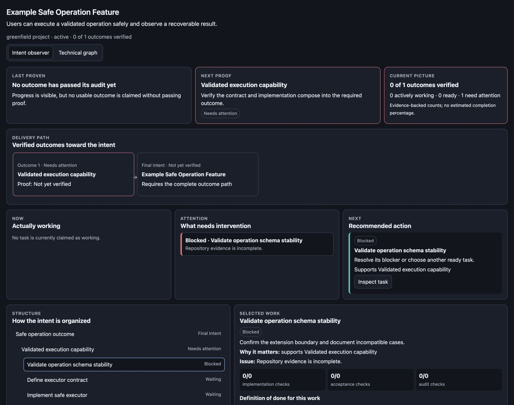
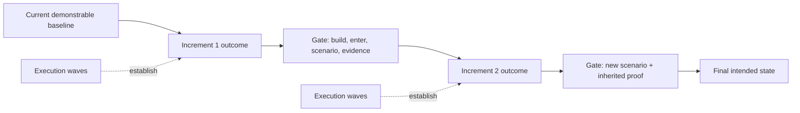
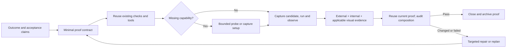
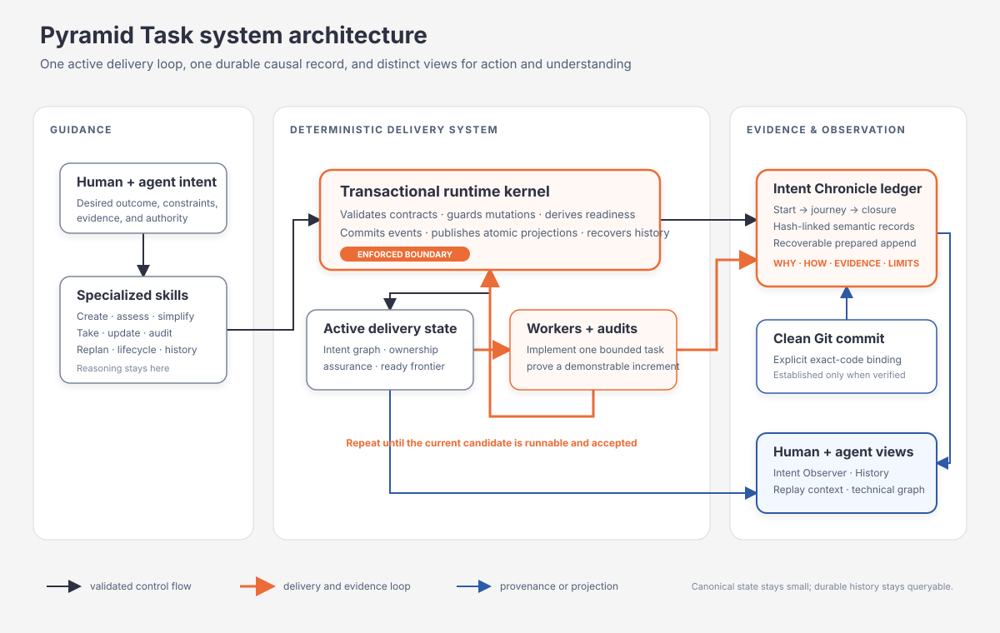
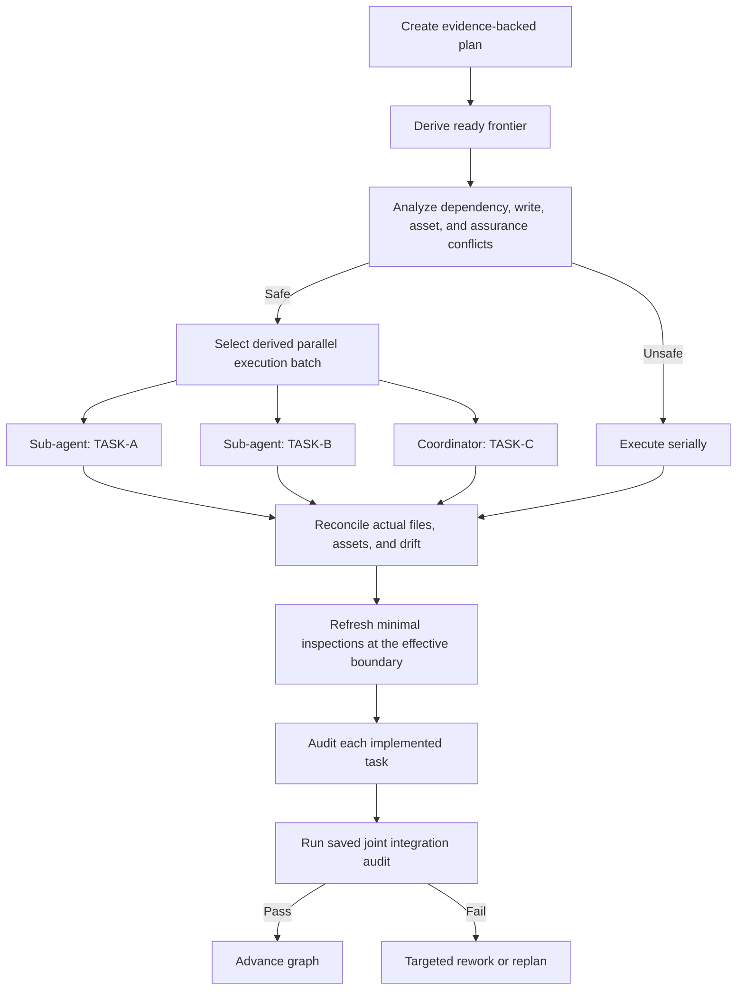
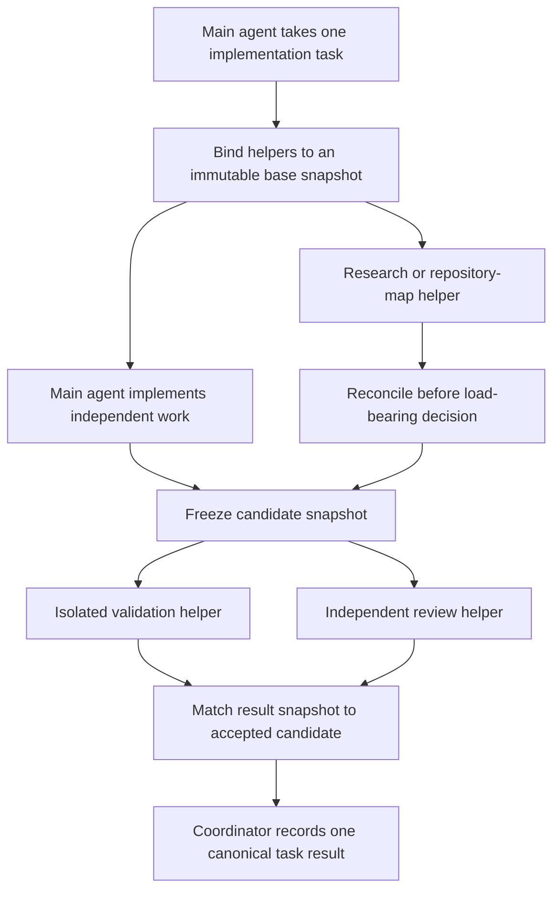
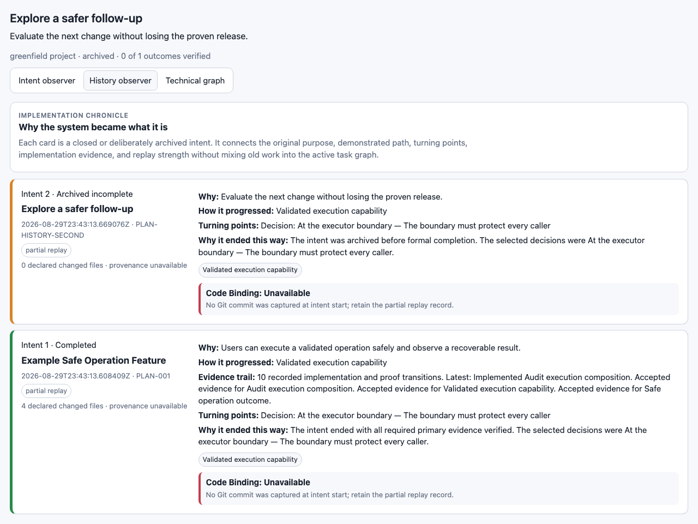

# Pyramid Task

[](https://github.com/KMerdan/pyramid-task/actions/workflows/ci.yml)
[](LICENSE)
[](https://www.python.org/)
[](https://developers.openai.com/codex/)

Pyramid Task turns a software intent into an evidence-backed ladder of demonstrable increments and an execution graph for reaching them. In an existing repository, it also maintains a change-assurance case: what exists, what a task may affect, which evidence remains fresh, and whether the completed branches actually establish a runnable or otherwise usable outcome.

Pyramid Task 4.2.0 makes status and proof easier to interpret, scopes routine queries, and adds a project-aware continuation-prompt skill. The project format remains V3, with 18 skills, 26 CLI commands and 31 schemas. Compact-by-default output, producer-scoped proof, task amendments, usage counters and outcome-scoped harnesses remain supported. Codex and Claude Code share the same `main` source package.

[Current context](CONTEXT.md) records the dated repository status; the
[documentation index](docs/README.md) routes readers to each topic owner.
The [4.2 improvement index](docs/planning/improvement/README.md) owns the A/B/C
scope, qualification and local integration boundary. Development uses installed
4.1 as controller while qualifying 4.2 source separately. This delivery does not
push or update installed plugins. Follow installation instructions after
publication; no current user-installation version is assumed.
Prompt clarity and fewer writes do not by themselves establish token savings.

The [4.1 development index](docs/planning/v4.1/README.md) links the completed
ladder and its evidence. The historical
[qualification report](proof-output/v4.1/TASK-432/qualification.md) distinguishes
real CLI regressions and isolated native-host runs from supplied decision fixtures.
It captures the pre-closure, pre-publication candidate, not current release status.
Read its measured limits before drawing efficiency or installed-release conclusions.

## Decision-centered progress in 4.2

- Distinguish recorded acceptance, current candidate eligibility and live publication health. The Observer does not watch source files or infer current proof from an old audit.
- Read selected status, harness and assurance slices. Use `--full` when omissions prevent a decision; retain full validation at trust, recovery and final acceptance boundaries.
- Lead with last recorded acceptance, next gate, blocking causes and selected-work proof. Claim-linked raster captures use bounded hash-checked reads; other artifacts download without executing HTML.
- Draft continuation with `pyramid-task:goal-prompt`, adapting to current phase, existing tools and actual authorization. Proposed grants and unknowns stay separate; the skill cannot grant permission or run cleanup.

```bash
python3 plugins/pyramid-task/scripts/pyramid.py inspect --project /path/to/project --assurance-detail --assurance-task TASK-201 --json
```

Selected assurance is not an editable bundle. The original STE-inspired trigger
profile is guidance, not ASD-STE100 compliance or a parser. Measurements report
bytes and local timings, not model tokens or human comprehension.

## Precise progress in 4.1

- Adding a consumer does not change its provider's own contract. Changed producer inputs, prerequisites, selected paths and parent composition still require current proof.
- Store the current task guard in invocation data, not a literal in reviewed executable source. A new guard neither changes source identity nor grants host permission.
- A blocked check blocks the claim that needs it. Continue other authorized dependency-safe work while retaining the blocker. Routine agent review is not new human authority.
- Create the smallest complete actor-visible journey first. Add only missing probe or capture capability, before the acceptance that consumes it.
- Replan by copying the current candidate and editing affected stable IDs/fields. The runtime still computes and validates the complete result; it only skips writes whose projection bytes are identical. Timestamped graph output normally changes.

For artifact size questions, run:

```bash
python3 plugins/pyramid-task/scripts/pyramid.py inspect --project /path/to/project --footprint --json
# Explicit detail: at most 100 file rows; scan at most 10,000 entries by default.
python3 plugins/pyramid-task/scripts/pyramid.py inspect --project /path/to/project --footprint --footprint-detail --json
```

This optional metadata scan distinguishes declared proof inputs, evidence, generated output and unknown purpose; it does not run during normal task queries. It reports logical bytes, excluded directories and incomplete scans, not Git/allocated-disk size. Current result/audit references are visible; historical and handoff retention is unknown. It never deletes files or declares evidence disposable. Use explicit proof-input scopes to prevent behavior source from being hidden under evidence-output globs.

Project queries use the existing serialization lock and may create its coordination
file if missing. Read-only means no semantic state/proof change or cleanup, not a
guarantee of zero coordination metadata. Mixed 4.0/4.1 hosts must not share an
actively rebound plan: unchanged installations do not imply mixed-version readiness.



## What it solves

A flat task list can say what to do without proving that:

- the proposed work connects to an observable final outcome;
- each delivery cycle ends at a runnable or otherwise demonstrable state instead of an arbitrary activity boundary;
- parallel branches compose safely;
- a brownfield system was inspected at the right boundary;
- an inspection still covers the implementation that now exists;
- generated files and evidence reports are distinguished from product changes;
- a worker resumes with the exact task context it previously held;
- concurrent activity is relevant before it is treated as a conflict.

Pyramid Task models these concerns explicitly. It keeps execution, verification, health, availability, lifecycle, and assurance separate, then derives the next safe action from their combination.

## Plan from demonstrable increments

Pyramid begins with the current demonstrable baseline and the smallest honest ladder of usable states to the intent. For software, an increment should build or launch and complete a meaningful actor-visible scenario. For infrastructure, data, research, or documentation, the proof changes, but the boundary remains observable and reproducible.

Each increment is represented with existing graph primitives: a primary outcome, its contributing work, and a `validated-by` audit gate. The outcomes normally form a cumulative ladder ending at the intent, while later gates re-establish earlier observable behavior against the current candidate. Multiple waves may serve one increment, and safe work for future increments may run ahead, but neither a wave nor a parallel batch is delivery evidence.


```mermaid
flowchart LR
    B["Current demonstrable baseline"] --> I1["Increment 1 outcome"]
    I1 --> G1["Gate: build, enter, scenario, evidence"]
    G1 --> I2["Increment 2 outcome"]
    I2 --> G2["Gate: new scenario + inherited proof"]
    G2 --> IN["Final intended state"]

    W1["Execution waves"] -. establish .-> I1
    W2["Execution waves"] -. establish .-> I2
```

The general term is **demonstrable increment**. A game launches into a playable slice; an API starts and serves a real request; a library installs and runs an example; infrastructure applies in a bounded environment and proves health and rollback; research resolves a stated decision with inspectable evidence. If only one honest increment exists, Pyramid keeps one instead of manufacturing ceremonial milestones.

Read the [demonstrable increment contract](plugins/pyramid-task/references/demonstrable-increments.md) for creation, graph representation, inherited proof, replanning, and progress reporting.

## Development harness: only what the outcome needs

Planning now designs the proof alongside the outcome. The agent inventories existing tools, selects external behavior, relevant internal invariants and applicable visual observations, and implements only missing capability. Visible behavior normally needs a rendered screenshot and actual model inspection through a project-fit browser tool; a successful API call is not proof of visual correctness. Headless outcomes explain why visual inspection is inapplicable.


```mermaid
flowchart LR
    O["Outcome and acceptance claims"] --> C["Minimal proof contract"]
    C --> R["Reuse existing checks and tools"]
    R --> M{"Missing capability?"}
    M -->|Yes| S["Bounded probe or capture setup"]
    M -->|No| P["Capture candidate, run and observe"]
    S --> P
    P --> E["External + internal + applicable visual evidence"]
    E --> A["Reuse current proof; audit composition"]
    A -->|Pass| L["Close and archive proof"]
    A -->|Changed or failed| F["Targeted repair or replan"]
    F --> C
```

This adds no scheduler, universal runner, new node kind or separate harness state file. Missing setup is ordinary scoped work and gates acceptance; unrelated product work may proceed concurrently. One valid run can support several tasks, an outcome and an inspection without repeated execution. Distinct composition or safety claims still need evidence.

New plans use **plan schema 2**. Their canonical `required_evidence[].verification` contracts generate `docs/tasks/DEVELOPMENT_HARNESS.md` and compact task instructions. The runtime checks declared input hashes (including dirty/untracked files), criterion/procedure identity, artifact hashes and required observation coverage. Visual review itself remains an agent responsibility, not a claim that Python understands screenshots.

```bash
python3 plugins/pyramid-task/scripts/pyramid.py inspect --project /path/to/project --harness TASK-201 --json
python3 plugins/pyramid-task/scripts/pyramid.py inspect --project /path/to/project --audit-readiness GATE-290 --json
```

Capture the first query before running checks; submit its filled `proofs` or a returned reusable run with normal update/audit. The runtime imports bounded artifacts into `.pyramid/reports/proof-artifacts/`, deduplicates content and preserves it with report archives. Do not edit that storage or the generated guide directly. Audit and closure recheck current inputs; the Observer displays recorded verification and its event watcher does not watch source files.

Existing schema-1 plans in V3 projects remain usable in **legacy-unbound** mode; no project is migrated during installation. Adopt schema 2 through a complete candidate replan and guarded apply. Older runtimes reject schema 2, and an active schema-2 plan cannot downgrade. Source/contract changes require fresh affected proof, not a new global assurance cycle. Replan also invalidates old/new dependent claims instead of leaving ancestors falsely verified.

See the [development harness contract](plugins/pyramid-task/references/development-harness.md), [schema-2 example](plugins/pyramid-task/assets/example-harness-plan.json), and [architecture](docs/architecture.md) for setup, evidence reuse, safety boundaries and lifecycle details.

## System architecture

Pyramid Task separates agent guidance from runtime enforcement. Specialized skills help agents choose the right workflow and produce bounded task or audit artifacts; the Python runtime validates every transition, maintains canonical `.pyramid` state, records immutable events, and regenerates disposable projections.

[](docs/images/pyramid-task-logical-workflow.svg)

| Layer | Canonical purpose | Agent-loading behavior |
| --- | --- | --- |
| `.pyramid/plan.json` | Current intent, graph topology, contracts, and evidence ledger | Selected node and goal trace only |
| `.pyramid/state.json` | Current execution, verification, health, ownership, and lifecycle | Selected state and direct dependencies only |
| `.pyramid/project.json` | Project format and greenfield/brownfield mode | Loaded when mode or migration matters |
| `.pyramid/baseline.json` | Current system assets, relations, history, and unknowns | Relevant baseline and impact slice only |
| `.pyramid/assurance.json` | Impacts, inspections, findings, drift, and controls | Relevant task or audit slice only |
| `.pyramid/events/*.json` | One immutable, hash-linked event per mutation | Not injected into normal prompts; query a bounded `diff` |
| `.pyramid/handoffs/` | Durable pause and resume evidence | Loaded only for the active handoff |
| `.pyramid/history/` | Semantically validated, hash-linked intent starts, chronicles, and clean Git bindings | Queried by intent, path, commit, bounded replay context, or ledger health |
| `.pyramid/head.json` | Atomic identity of the committed canonical state | Used to validate publication and context |
| Graph, ready, Markdown, and HTML files | Human and machine-readable projections | Regenerated; never mutation inputs |

The event history is not a Git object database or a growing version array inside one JSON document. Events may contain before/after evidence, but each mutation is a separate immutable file. Normal agent packets do not include that history. `diff` returns compact changed-field summaries by default and includes full values only with `--detail`.

### Intent history without an ever-growing active plan

Each new intent gets an immutable start record. Closing it—or deliberately archiving it incomplete—adds one causal chronicle containing its starting and ending plans, demonstrated outcome path, decisions and turning points, task-to-file evidence, reports, provenance gaps, and replay limitations. Reset starts a fresh active graph but preserves the ledger; restore never rolls the project-wide ledger backward.

The ledger separates claims that are easy to blur:

- a chronicle explains why and how an intent ended;
- task result bindings connect implementation work to declared files and checks;
- a later clean Git binding proves that the exact committed repository range matches those declarations.

This supports both observers. A human can follow purpose → progress → turning points → final rationale. An agent can query only the relevant intent, path, commit, or replay manifest instead of loading every historical graph. Replay is reported honestly as `partial`, `behaviorally-equivalent`, or `artifact-identical`; inspection never executes recorded commands automatically.

History capture is lifecycle-driven; agents do not need a reminder at every transition:

| Boundary | History behavior |
| --- | --- |
| `create`, `reset` | Automatically append or reconstruct the intent-start record |
| Task updates, audits, replans, and other mutations | Automatically retain hash-linked plan events used by the final journey |
| `close` or deliberate archive | Automatically append a completed or incomplete chronicle |
| Clean Git provenance | Explicitly run `history --bind` after committing implementation |
| Binding ledger publication | Commit the resulting `.pyramid/history` and regenerated projection changes normally |

An append first writes a recoverable `transaction.json`, publishes the immutable record and hash-linked head, rebuilds the disposable index, validates the committed ledger, and only then clears the transaction. Normal history reads stop on a pending transaction. Diagnose and, with recovery authority, complete the exact prepared append:

```bash
python3 plugins/pyramid-task/scripts/pyramid.py history \
  --project /path/to/project --doctor --json
python3 plugins/pyramid-task/scripts/pyramid.py history \
  --project /path/to/project --repair --json
```

The ledger is tamper-evident relative to a trusted `head.json`; it is not an external signature, trusted timestamp, or substitute for repository access controls. Chronicles can contain plans, paths, commands, and runtime metadata, so review them before publishing a repository. Corrections append a new chronicle cycle or binding instead of editing old records.

### System properties and limits

| Property | Benefit | Deliberate limit |
| --- | --- | --- |
| Active graph separated from chronicles | Current agents load only actionable context; humans retain the full causal story | Cross-intent comparisons use a projection rather than one giant graph |
| Deterministic runtime behind reasoning skills | The same transition and evidence rules apply across Codex and Claude Code | Semantic planning quality still depends on agent reasoning and review |
| Demonstrable-increment gates | Every delivery rung targets a runnable or otherwise observable result | A passed command proves only the evidence actually recorded |
| Hash-linked, semantically validated records | Detects content, metadata, ordering, and reference corruption | Trust still begins at the checked-in head and Git repository |
| Recoverable prepared appends | A crash cannot silently leave mixed history accepted as valid | Divergent or malformed transactions require investigation, not automatic invention |
| Explicit replay and binding states | Humans and agents can distinguish behavioral evidence from exact code identity | Environment-dependent behavior cannot be guaranteed by a tree hash alone |

## Exact context at the mutation boundary

Pyramid Task uses two concurrency scopes:

| Mutation | Context to use | Why |
| --- | --- | --- |
| `take`, `update`, `pause` for a selected task | `mutation_guards.task` | Binds the task contract, its state and dependencies, baseline, and relevant impacts |
| `audit` | `mutation_guards.audit` from `inspect --audit-readiness` | Binds covered claims, implementation frontier, and relevant assurance |
| `resume` | Canonical handoff hashes and reported drift | Protects paused graph, assurance, and worktree context |
| `impact`, `assess`, topology, lifecycle, reset, and restore | `context.graph_version` plus `context.id` | These operations intentionally affect shared canonical state |

An unrelated inspection refresh may advance the global event sequence without invalidating a worker packet. A relevant task, dependency, baseline, impact, implementation, or inspection change still invalidates the corresponding scoped guard. On conflict, refresh only that task or audit packet.

```bash
# Find work without loading every task in full.
python3 plugins/pyramid-task/scripts/pyramid.py inspect \
  --project /path/to/project --ready --json

# Claim the selected task using its task guard.
python3 plugins/pyramid-task/scripts/pyramid.py take \
  --project /path/to/project --node TASK-203 --actor worker \
  --expected-guard <task-guard> --json

# Submit implementation with the refreshed task guard returned by take.
python3 plugins/pyramid-task/scripts/pyramid.py update \
  --project /path/to/project --node TASK-203 --actor worker \
  --status implemented --result result.json \
  --expected-guard <task-guard> --json

# Load the exact audit blockers and audit guard immediately before audit.
python3 plugins/pyramid-task/scripts/pyramid.py inspect \
  --project /path/to/project --audit-readiness GATE-205 --json
```

## Context efficiency

Available in 3.9.0: `amend`, compact output by default, and `--full` for complete responses. CLI consumers requiring the pre-3.9 response shape must add `--full`; canonical records and Python API responses are unchanged.

Pyramid's `--compact` reduces CLI response data; it does not compact the host conversation. Automatic conversation compaction and phase-triggered compaction hooks are not implemented.

Spend context on the current decision, not repeated planning. Create loads graph, harness and candidate-refinement guidance; detailed path comparison, multi-increment design and brownfield assurance are loaded only when applicable. Reuse current baseline facts and task packets. A correction triggers another review only for concrete findings and affected invariants.

| Situation | Smallest sufficient path |
| --- | --- |
| Routine progress with the task contract already in context | `update --json`: compact status, blockers and guards by default |
| An existing implementation/context file is discovered inside the same task outcome | Preview/apply an `amend` delta; retain the claim |
| Acceptance, proof inputs/procedure, dependencies or authority must change | Normal guarded `replan` with candidate review |
| Context was lost or work is handed off | Full `inspect --node`, `take` or `resume` packet |

CLI responses are compact by default: duplicate event snapshots and unchanged update contract fields, including static harness contracts, are omitted. Payloads, failed evidence, warnings, invalidations, dependencies and ownership remain. Explicit `omitted_fields` and event paths make the projection recoverable; canonical records and Python API responses remain complete. Use `--full` when more decision detail is necessary or an existing CLI consumer requires the old complete response shape; `--compact` remains an explicit alias for the default. Recover missing detail afterward through a read-only node/event query, never by repeating a mutation. A concurrent mutation causes update to retain its full packet. Read current proof freshness through audit readiness, not a compact progress acknowledgment. `--full` restores the selected command's response, not broader query scope such as `diff --detail`.

An amendment accepts only exact existing files within an unchanged working task's outcome. It checks ownership, active-task conflicts and brownfield mappings. In schema-2 plans, added write files must already be covered by that task's resolved verification inputs. Otherwise replan the proof contract first. Input coverage does not establish semantic test sufficiency or authorize broader work. New files and changes to acceptance, procedures or generated-output policy also require replan.

```bash
python3 plugins/pyramid-task/scripts/pyramid.py amend \
  --project /path/to/project --proposal amendment.json --actor worker \
  --preview --json
python3 plugins/pyramid-task/scripts/pyramid.py amend \
  --project /path/to/project --proposal amendment.json --actor worker \
  --apply --expected-amendment <preview-amendment-id> --json
```

Already-small responses remain unchanged when compact metadata would add overhead. See the [amendment contract and proposal example](plugins/pyramid-task/references/task-amendments.md). Reduced JSON bytes and reference words measure context size; they are not a claim of measured end-to-end model token or latency savings.

## Global command usage audit (4.0.0)

Ask the agent: **“Analyze the Pyramid usage audit for the last 30 days and identify possible workflow overhead.”** This is part of the existing `pyramid-task:inspect` skill, not a new slash command. For explicit routing:

```text
Use $pyramid-task:inspect to analyze the Pyramid usage audit for the last 30 days.
```

`inspect` reads usage counters and explains patterns; `pyramid-task:audit` verifies a task, gate, outcome or intent against evidence. Say “usage audit” when you mean command efficiency, not task acceptance. The agent first checks measurement coverage, then compares command frequency, failures and output/runtime cost, separates facts from hypotheses, and proposes targeted follow-up checks. Analysis alone does not authorize workflow changes or command removal. This routing and collection require plugin 4.0.0 or later; older installations need an update.

Measure the workflow before simplifying it. Every parsed CLI execution records a local invocation, exit outcome, wall-clock duration and JSON stdout byte count. Counters are aggregated by UTC day, runtime version, command, allowlisted mode (such as preview/apply or update status), and compact/full format. No arguments, project paths, task IDs, actor names, prompts, source, or command output are stored. Nothing is sent over the network.

```bash
python3 plugins/pyramid-task/scripts/pyramid.py inspect --usage --json
python3 plugins/pyramid-task/scripts/pyramid.py inspect --usage --usage-days 30 --json
# Only when comparing query modes, runtime versions or compact/full output:
python3 plugins/pyramid-task/scripts/pyramid.py inspect --usage --usage-days 30 --full --json
```

No project is required. The report includes every CLI command, including zero-count commands; compact zero-count rows omit redundant outcome/cost fields. Reading it does not create or update counters. The audit itself adds no skill or top-level command. Published 4.1 has 17 skills and 26 CLI commands after removing `upgrade`; this improvement candidate adds the drafting-only goal-prompt skill, not a CLI command. Recorded counts for older removed commands remain visible as history, not available operations.

The shared default store is `~/.local/state/pyramid-task/usage.sqlite3` (`$XDG_STATE_HOME/pyramid-task/usage.sqlite3` when configured). Codex and Claude Code aggregate into the same store when they share this location. Use an absolute `PYRAMID_USAGE_DIR` to choose another directory, or `PYRAMID_USAGE=off` to disable collection while retaining readable prior counts. The store is separate from project `.pyramid` artifacts and versioned plugin caches, so project cleanup and plugin updates do not reset it. It is machine-local, not synchronized across devices.

Each host must permit writes to the chosen directory. If its sandbox disallows them, collection warns on stderr and the command continues unchanged; there is no project-local fallback or automatic permission expansion. Do not run development commands unsandboxed merely to collect usage. Report status distinguishes an empty store from an unreadable/corrupt one; it cannot prove that all earlier calls were recorded. Tests disable collection or use isolated temporary stores.

Interpretation limits:

- Collection starts with this implementation; older releases, disabled collection, help/parser errors, Python API calls and the usage report itself are not counted. Do not backfill graph events as if they measured reads or skill invocation.
- `unfinished` includes running, killed, or completion-recording failures; it does not mean the task failed. Live visualization duration includes the server lifetime. Failure counts refer to CLI exits, not necessarily product defects.
- CLI usage cannot establish which skill was read or followed. `orchestrate`, `simplify` and the candidate `goal-prompt` have no standalone CLI entry point and are explicitly unmeasured, not unused.
- High counts, repeated failure modes and large output may identify friction to investigate. Low counts may reflect recovery-only commands or the current development phase; historical counts for removed commands do not imply current availability. Counts alone do not justify removing gates, audits or lifecycle protection; bytes and runtime are not model token or latency measurements.

## Parallel execution with sub-agents

Pyramid now derives parallel groups from the live ready frontier. It does not add another mutable scheduler file or store group snapshots in the graph. A task can join a group only when it is in the same execution wave and the runtime finds no dependency, write/evidence/generated-output, asset, inspection-policy, broad-scope, or open-drift conflict.

`level` is distance from the intent. `wave` is earliest safe execution time. A demonstrable increment is an accepted usable state. These are separate dimensions: tasks at the same level are not automatically independent, same-wave tasks still need conflict analysis, and a completed wave is not a runnable release.


```mermaid
flowchart TD
    P["Create evidence-backed plan"] --> F["Derive ready frontier"]
    F --> C["Analyze dependency, write, asset, and assurance conflicts"]
    C -->|Safe| G["Select derived parallel execution batch"]
    C -->|Unsafe| S["Execute serially"]
    G --> A1["Sub-agent: TASK-A"]
    G --> A2["Sub-agent: TASK-B"]
    G --> A3["Coordinator: TASK-C"]
    A1 --> R["Reconcile actual files, assets, and drift"]
    A2 --> R
    A3 --> R
    S --> R
    R --> I["Refresh minimal inspections at the effective boundary"]
    I --> T["Audit each implemented task"]
    T --> J["Run saved joint integration audit"]
    J -->|Pass| N["Advance graph"]
    J -->|Fail| W["Targeted rework or replan"]
```

This is the canonical conceptual lifecycle. The deterministic runtime recommends the batch; the host agent owns sub-agent creation. One coordinator owns the authoritative `.pyramid`, claims tasks, integrates patches, records updates, refreshes assurance, and runs audits. Source-writing executors use separate code worktrees and never mutate worktree-local Pyramid state. Their prompts contain only the exact claimed packet—not the full graph or event history. If isolated workspaces or safe integration are unavailable, source work stays serial.

### Two levels of useful parallelism

Pyramid uses graph-task workers first because they advance independently auditable outcomes. When the ready frontier contains only one task—or a selected batch does not consume every host slot—the coordinator may use the remaining capacity for ephemeral helpers inside its retained task.


```mermaid
flowchart TD
    T["Main agent takes one implementation task"] --> B["Bind helpers to an immutable base snapshot"]
    B --> R["Research or repository-map helper"]
    B --> C["Main agent implements independent work"]
    R --> D["Reconcile before load-bearing decision"]
    C --> S["Freeze candidate snapshot"]
    D --> S
    S --> V1["Isolated validation helper"]
    S --> V2["Independent review helper"]
    V1 --> J["Match result snapshot to accepted candidate"]
    V2 --> J
    J --> U["Coordinator records one canonical task result"]
```

Research, reconnaissance, test discovery, and risk review are often read-only. Validation commands are not assumed read-only: tests and builds may write caches, coverage, generated files, databases, or snapshots. Repository-bound helpers therefore read an immutable snapshot, and write-producing checks run only in a disposable worktree or sandbox. Helper jobs and results are bounded serialized envelopes, but they are not graph nodes, events, versions, claims, or mutation guards.

Graph-task reservations always win. Only the coordinator owns the global slot ledger, helper jobs, canonical task guard, and evidence promotion. A helper result remains advisory until it rejoins at its declared boundary; candidate evidence is final only when its snapshot exactly matches the accepted candidate.

```bash
python3 plugins/pyramid-task/scripts/pyramid.py inspect \
  --project /path/to/project --parallel-ready --max-agents 4 --json
```

The response identifies safe groups, claim guards, isolation mode, per-inspection planned refresh policies, the effective boundary required by audit freshness, a common join gate, and reasons each remaining task must stay serial. Groups are ordered by earliest wave, highest slot use, then deterministic group ID. Save the selected join metadata, because implemented tasks leave the ready frontier; re-run the query after the batch audits finish.

### Parallel batch IDs

A group ID has the form `PARALLEL-W<wave>-<10 uppercase hex>`. The suffix is the first 10 hexadecimal characters of SHA-256 over the plan ID, wave, and sorted task IDs. The same derived batch therefore receives the same ID even if candidate input order changes.

The ID is a disposable correlation handle for logs, prompts, and join metadata. It is not a graph node, event/version ID, persistent scheduler record, lock, authorization token, or mutation guard. Its batch can change or disappear whenever readiness, dependencies, scopes, assets, assurance, drift, wave membership, or the agent limit changes. Re-run `inspect --parallel-ready` after any such change and use each task's current claim guard for mutations.

Read the [parallel execution contract](plugins/pyramid-task/references/parallel-execution.md) for worker prompt and safety rules.
Read the [intra-task helper contract](plugins/pyramid-task/references/intra-task-helpers.md) for helper eligibility, snapshots, result bounds, and slot ownership.

## Assurance at the right time

For brownfield work, each performed inspection can record the exact latest `task.implemented` event it validated. Readiness and audit use the same freshness engine, so the summary cannot say “ready” while the audit would reject older inspection evidence.

`inspect --audit-readiness` returns:

- structural and assurance blockers for that target;
- the covered task IDs;
- the audit-scoped mutation guard;
- the minimal `refresh_inspection_ids` set.

Refresh only those inspections at their planned wave, pre-audit, or release boundary. `refresh_policy` documents the intended batching boundary; it does not waive freshness at audit time.

Implementation results distinguish these change classes:

- `source`, `runtime`, and `configuration` for authored product behavior;
- `generated` for declared build output mapped to real baseline assets;
- `evidence` for artifacts inside an explicit evidence-output scope;
- `unknown` for changes that need conservative review.

Evidence-only artifacts do not create product scope drift or stale product inspections by default. Generated output avoids false drift only when its path pattern and existing asset IDs were declared in the task contract; it still invalidates inspections covering the generated behavior. Baseline `exclude_locators` and inspection `invalidated_by` rules provide narrower control without weakening unknown-scope handling.

Impact preview hashes exclude publication metadata, so previewing unchanged semantic content returns the same candidate hash. Apply recomputes the candidate under the project lock.

Read the [brownfield assurance contract](plugins/pyramid-task/references/brownfield-assurance.md) for the complete evidence and invalidation rules.

## Live visualization

The browser opens on a human-first **Intent Observer**. It answers what the current intent is, what outcome was last proven, what proof comes next, what work is actually active, what needs intervention and why, what action is recommended, and how the selected path is organized. It reports verified outcomes rather than inventing a completion percentage from task counts.

The **History Observer** presents each prior intent as a semantic causal card: why it began, the demonstrated path, recorded turning points, why it ended that way, changed-file provenance, replay strength, and the next Git-binding action when exact reproduction is not yet established. Historical task nodes never re-enter the active ready frontier.



The **Technical graph** remains available as a drill-down with focus, star, pyramid, and dependency layouts plus task state, handoffs, assurance, assets, inspections, findings, drift, blockers, and publication health. Machine IDs, graph revisions, raw enums, and overlays no longer dominate the landing view.

```bash
python3 plugins/pyramid-task/scripts/pyramid.py visualize \
  --project /path/to/project --live --open --json
```

Live mode serves only on loopback. The default watcher checks for a validated atomic graph publication every 250 milliseconds and rerenders only when the slim visualization payload changes semantically. Raw canonical writes are never broadcast. If compilation lags or a publication fails validation, the browser retains the last valid graph and reports publication health rather than presenting partial state.

Static visualization remains self-contained for archives and sharing:

```bash
python3 plugins/pyramid-task/scripts/pyramid.py visualize \
  --project /path/to/project --output /path/to/pyramid.html --json
```

## Install

Requirements: Codex or Claude Code with plugin support, plus Python 3.10 or newer.

### Codex

```bash
codex plugin marketplace add KMerdan/pyramid-task --ref main
codex plugin add pyramid-task@kmerdan-skills
```

Update an existing installation:

```bash
codex plugin marketplace upgrade kmerdan-skills
codex plugin add pyramid-task@kmerdan-skills
```

### Claude Code

The same `main` branch contains both runtime manifests:

```bash
claude plugin marketplace add KMerdan/pyramid-task
claude plugin install pyramid-task@kmerdan-skills
```

Update an existing Claude Code installation:

```bash
claude plugin marketplace update kmerdan-skills
claude plugin update pyramid-task@kmerdan-skills
```

Start a new agent session after installation or update so the runtime discovers the current skills.

Both examples register the GitHub repository, so marketplace refreshes can fetch newer commits. A marketplace registered with a local directory remains local: refreshing it does not pull GitHub. Check `codex plugin marketplace list` or `claude plugin marketplace list`; if `kmerdan-skills` still points at a development/recovery folder, replace that marketplace source with `KMerdan/pyramid-task` through the host CLI and reinstall the same `pyramid-task@kmerdan-skills` plugin. Keep any local development source backed up; do not register a second marketplace name to get an update.

## Recommended workflow

1. Establish the current demonstrable baseline, define the smallest honest increment ladder, and create the intent graph. Existing repositories default to brownfield mode.
2. Assess the system baseline and map change impact before relying on brownfield audits.
3. Inspect the compact ready frontier; derive one conflict-safe parallel group when multiple agent slots are available.
4. Claim each selected task with its scoped guard, give graph workers exact packets first, then use spare slots for bounded snapshot-safe helpers.
5. Report implementation with actual files, assets, checks, evidence, and typed change effects.
6. Refresh shared inspections once at the returned batch boundary.
7. Audit implementation nodes and the common composition gate independently.
8. Close only after the intent and assurance case pass; keep the returned chronicle ID.
9. After the implementation is committed and the worktree is clean, bind that chronicle to Git for exact repository provenance. Commit the appended binding record and regenerated projections, then archive or start a new intent; transition previews surface any missing binding.

Natural-language entry points:

```text
Use $pyramid-task:create to turn this feature request into an evidence-backed implementation plan.
Use $pyramid-task:assess to baseline this existing system.
Use $pyramid-task:impact to map affected assets and required inspections.
Use $pyramid-task:inspect to show the ready frontier or audit readiness.
Use $pyramid-task:inspect to analyze the Pyramid usage audit for the last 30 days.
Use $pyramid-task:orchestrate to run one conflict-safe ready batch with sub-agents.
Use $pyramid-task:take to claim the next safe task.
Use $pyramid-task:update to record implementation and actual change scope.
Use $pyramid-task:audit to verify a task, composition gate, outcome, or intent.
Use $pyramid-task:pause and $pyramid-task:resume for a durable handoff.
Use $pyramid-task:history to explain why a path changed, return bounded replay context, or diagnose a pending ledger append.
Use $pyramid-task:visualize to open the live intent, history, and technical views.
Use $pyramid-task:lifecycle to close, archive, reset, or restore a plan.
```

Create directly through the deterministic runtime:

```bash
python3 plugins/pyramid-task/scripts/pyramid.py create \
  --project /path/to/project \
  --plan plugins/pyramid-task/assets/example-plan.json \
  --actor planner --mode auto --json
```

For a reviewed brownfield plan, include the baseline and assurance candidates:

```bash
python3 plugins/pyramid-task/scripts/pyramid.py create \
  --project /path/to/project --plan plan.json --actor planner --mode auto \
  --baseline baseline.json --assurance assurance.json --json
```

If the baseline is not known, creation writes a deliberately incomplete placeholder. Bounded discovery can begin, but brownfield audits cannot pass until `assess` and `impact` establish sufficient evidence.

## Included skills

Version 4.2 adds `pyramid-task:goal-prompt` (18 skills, still 26 CLI
commands). This is a drafting method, not a new runtime command or an installed
4.1 capability. Ask: “Use pyramid-task:goal-prompt to draft continuation for this
project's current intent and existing authorization.” It discovers only relevant
project/phase/harness facts, keeps proposed grants and unknowns separate, and
does not execute, approve or clean anything. Browser/guest/artifact modules are
included only when applicable; a headless project gets no copied VM paragraph.

| Skill | Purpose |
| --- | --- |
| `pyramid-task:create` | Clarify intent, define demonstrable increments, compare paths, and create the first graph. |
| `pyramid-task:simplify` | Fact-check and reduce unjustified graph complexity while preserving real increment, outcome, and assurance boundaries. |
| `pyramid-task:new-intent` | Safely route a distinct intent through create, archive, and reset. |
| `pyramid-task:goal-prompt` | Draft safe project-aware continuation from the current intent, harness and actual authority. |
| `pyramid-task:assess` | Establish or refresh the existing-system baseline. |
| `pyramid-task:impact` | Map affected assets, inspections, findings, drift, and controls. |
| `pyramid-task:inspect` | Query status, readiness and audit freshness; analyze the global command usage audit and possible workflow overhead. |
| `pyramid-task:history` | Explain cross-intent causality, trace path or commit provenance, and return bounded replay context. |
| `pyramid-task:orchestrate` | Coordinate graph-task workers first, then use spare slots for bounded helpers. |
| `pyramid-task:take` | Claim one ready task and opportunistically delegate safe read-only helper work. |
| `pyramid-task:pause` | Pause owned work with an immutable evidence-aware handoff. |
| `pyramid-task:resume` | Validate and resume the canonical handoff with a fresh lease. |
| `pyramid-task:update` | Record implementation, evidence, actual scope, blockers, and risk. |
| `pyramid-task:audit` | Verify tasks, branch composition, demonstrable increments, outcomes, and the final intent. |
| `pyramid-task:expand` | Add an approved subtree while preserving the parent contract. |
| `pyramid-task:replan` | Revise invalid topology or increment boundaries while preserving valid work and history. |
| `pyramid-task:lifecycle` | Reopen, close, archive, reset, clean, and restore plans. |
| `pyramid-task:visualize` | Render active Intent and cross-intent History observers with a technical graph drill-down. |

## Lifecycle, expansion, and compatibility

Implementation is not verification. A brownfield intent is complete only after primary claims pass independent audits, assurance has no blockers, and `close` writes the final report, change dossier, and immutable intent chronicle. The verified changed baseline and project-wide chronicle ledger are then carried into the next planning cycle.

Use `pause` for an interruption, `expand` when a valid task contract needs multiple internal work units, and `replan` when evidence changes the contract or selected path. All topology and lifecycle changes preserve history and use explicit preview or evidence boundaries.

Use `new-intent` for the next distinct outcome. It chooses the safe create, archive/reset, reset, or blocked route from actual project state and binds an existing-project transition to one approval hash.

V2/V2.1 project migration has been removed in 4.0.0: no `upgrade` skill, CLI command or internal `new-intent` migration remains. `new-intent --from-version` is also removed. Existing projects and restored archives must have a valid V3 `.pyramid/project.json`; unsupported legacy data is rejected before writes, not converted or reset. If a V3 manifest was accidentally lost, restore its original backup rather than fabricating one. Existing V3 migration provenance and assurance obligations remain valid, and V3 plans using schema 1 still work. Plugin installation updates are unrelated and remain supported. Older standalone `pyramid-task-planner` installations should be replaced by the compatibility router in `compat/pyramid-task-planner`; `doctor --json` reports the conflict.

Detailed contracts:

- [Evidence-based plan refinement](plugins/pyramid-task/references/plan-refinement.md)
- [Demonstrable increments](plugins/pyramid-task/references/demonstrable-increments.md)
- [Graph and state](plugins/pyramid-task/references/graph-contract.md)
- [Agent and audit packets](plugins/pyramid-task/references/agent-contracts.md)
- [Parallel execution](plugins/pyramid-task/references/parallel-execution.md)
- [Intra-task helpers](plugins/pyramid-task/references/intra-task-helpers.md)
- [Brownfield assurance](plugins/pyramid-task/references/brownfield-assurance.md)
- [Visualization](plugins/pyramid-task/references/visualization-contract.md)
- [Intent chronicles and replay](plugins/pyramid-task/references/history-contract.md)
- [Pause and resume](plugins/pyramid-task/references/handoff-contract.md)
- [Lifecycle](plugins/pyramid-task/references/lifecycle-contract.md)
- [Expansion](plugins/pyramid-task/references/expansion-contract.md)
- [New intent](plugins/pyramid-task/references/new-intent-contract.md)

## State model

- Execution: `planned`, `working`, `paused`, `implemented`, `needs-rework`, `superseded`
- Verification: `unverified`, `pending`, `passed`, `failed`
- Health: `clear`, `at-risk`, `blocked`
- Plan lifecycle: `active`, `completed`, `archived`
- Assurance: `incomplete`, `ready`, `stale`, `passed`

Availability is derived from these dimensions and graph dependencies; agents do not write it directly.

## Repository layout

```text
.agents/plugins/marketplace.json        Public marketplace definition
plugins/pyramid-task/
├── .codex-plugin/plugin.json          Codex manifest
├── .claude-plugin/plugin.json         Claude Code manifest
├── skills/                            Eighteen agent interfaces
├── scripts/
│   ├── pyramid.py                     Thin command-line adapter
│   ├── pyramid_core.py                Transaction and compatibility facade
│   ├── pyramid_graph.py               Pure graph and readiness primitives
│   ├── pyramid_parallel.py            Pure parallel-frontier analysis
│   ├── pyramid_assurance.py           Assurance domain rules
│   ├── pyramid_amendment.py           Pure additive candidate preparation
│   ├── pyramid_output.py              Loss-aware CLI response projections
│   ├── pyramid_usage.py               Local cross-project CLI counters
│   ├── pyramid_verification.py        Outcome-scoped proof and candidate inputs
│   ├── pyramid_history.py             Append-only intent provenance and replay rules
│   ├── pyramid_live.py                Validated loopback live server
│   └── pyramid_visualizer.py          Static interactive renderer
├── schemas/                           Published JSON contracts
├── references/                        Graph, assurance, agent, and lifecycle contracts
├── assets/                            Valid plan, review, baseline, assurance, expansion, and handoff examples
└── tests/                              Runtime and visualization regression tests
tools/validate_repository.py           Repository-level contract validation
```

## Development

```bash
python3 -m venv .venv
source .venv/bin/activate
python3 -m pip install -r requirements-dev.txt
make check
```

See [CONTRIBUTING.md](CONTRIBUTING.md) for design invariants and review expectations. Security issues should follow [SECURITY.md](SECURITY.md). Release changes are recorded in [CHANGELOG.md](CHANGELOG.md).

For what the tests execute versus simulate, see [test scope and evidence](CONTRIBUTING.md#test-scope-and-evidence). Passing runtime tests does not certify an agent's semantic or visual review.

Maintainers can read [docs/architecture.md](docs/architecture.md) for module boundaries and the incremental plan for reducing `pyramid_core.py` without a compatibility-breaking rewrite.

## License

MIT © 2026 Dr. Merdan Bay. See [LICENSE](LICENSE).

Pyramid Task is an independent open-source project and is not affiliated with or endorsed by OpenAI.
