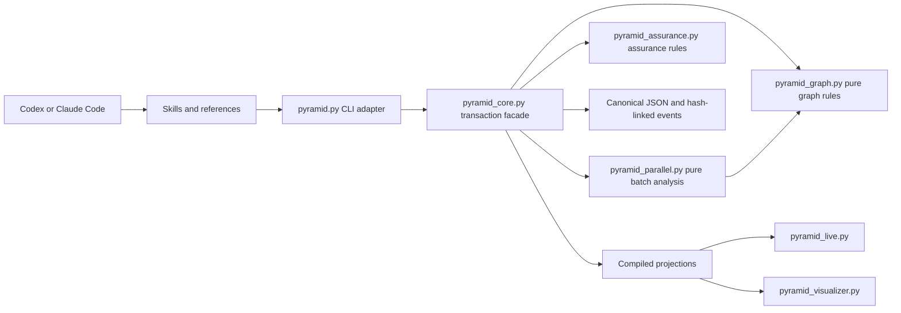

# Runtime Architecture

Pyramid separates deterministic state mechanics from agent reasoning. Skills decide how to gather evidence, choose work, and coordinate agents. Python validates contracts, derives state, and commits guarded mutations.

Plan refinement follows the same boundary. The `simplify` skill fact-checks and challenges a complete candidate, while `plan-review.schema.json` validates only the shape of its reasoning record. The review and its schema do not prove semantic claims, and candidate refinement does not mutate canonical state; changes to an existing graph still use replan preview and guarded application.

## Current module boundaries

The dependency direction is intentional:

- pure domain modules do not import `pyramid_core`;
- `pyramid_core` remains the compatibility facade for existing imports and owns locks, guarded transactions, events, and publication;
- the CLI translates arguments and errors but does not contain domain policy;
- live and static visualization consume validated projections, never partial canonical writes;
- skills may coordinate sub-agents, while the runtime only returns deterministic scheduling facts.

`pyramid_parallel.py` is read-only. Its output is a disposable projection validated by `parallel-frontier.schema.json`; it is never written into canonical plan or state. A `PARALLEL-W…` ID deterministically correlates one derived plan/wave/task grouping, but it is not canonical identity, history, or a concurrency guard.

## Why not split everything at once

`pyramid_core.py` accumulated storage, validation, projection, query, and lifecycle responsibilities. A big-bang rewrite would create high regression risk in graph history, locks, migration, and serialized contracts. New behavior should land behind pure functions first, then existing functions can move without changing their public signatures.

## Incremental extraction sequence

1. **Graph primitives** — node lookup, typed edges, blockers, and availability. Extracted to `pyramid_graph.py`.
2. **Derived scheduling** — conflict and parallel-frontier analysis. Isolated in `pyramid_parallel.py`.
3. **Storage and publication** — paths, JSON loading, locks, atomic commits, head validation, and event writes.
4. **Projection** — graph, ready index, Markdown, archive, and browser payload compilation.
5. **Task lifecycle** — take, update, pause, resume, audit, and scoped guards.
6. **Topology lifecycle** — create, replan, expand, upgrade, reset, restore, and new-intent transitions.
7. **Queries** — inspect, diff, readiness, and closure views.

Each extraction should preserve the compatibility imports from `pyramid_core.py`, add focused tests around the moved boundary, and avoid serialized changes unless a published schema is updated.

## Parallel orchestration boundary

The runtime answers “which current tasks are safe together?” using only current canonical and assurance state. It does not spawn agents or manage worktrees. One coordinator keeps the only mutable `.pyramid` root; executors work in isolated code worktrees and return patches for verified, sequential integration. The orchestration skill:

1. validates the project;
2. requests a derived group for the available slots;
3. claims tasks centrally and assigns exact packets to isolated executors;
4. verifies and integrates scoped patches before canonical task updates;
5. stops cleanly on unexpected overlap or drift;
6. refreshes shared inspections at the effective boundary required by audit freshness;
7. independently audits tasks and rejoins through the saved common gate;
8. recomputes the next frontier.

This keeps host-specific concurrency outside canonical state while retaining deterministic, testable safety decisions.
