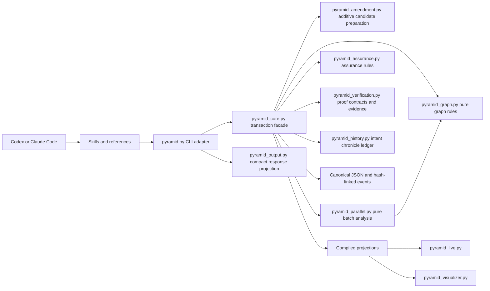
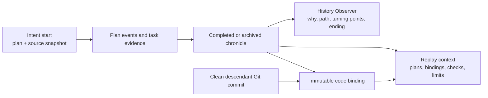

# Runtime Architecture

Pyramid separates deterministic state mechanics from agent reasoning. Skills decide how to gather evidence, choose work, and coordinate agents. Python validates contracts, derives state, and commits guarded mutations.

Demonstrable increments follow the same boundary. Creation and replanning reason from the current usable baseline to an ordered ladder of actor-visible outcomes. They encode each rung with existing outcome, audit, and typed-edge primitives. The runtime enforces those graph relations and audit transitions but does not add mutable increment state or reinterpret `wave` as delivery progress.

Plan refinement follows the same boundary. The `simplify` skill fact-checks and challenges a complete candidate, while `plan-review.schema.json` validates only the shape of its reasoning record. The review and its schema do not prove semantic claims, and candidate refinement does not mutate canonical state; changes to an existing graph still use replan preview and guarded application.

Intra-task helper delegation follows that boundary too. Skills decide when spare host capacity justifies a research or validation helper. `helper-job.schema.json` and `helper-result.schema.json` validate compact envelopes, but no runtime file stores helper lifecycle and no helper owns a graph mutation.

## Current module boundaries

```mermaid
flowchart LR
    H["Codex or Claude Code"] --> K["Skills and references"]
    K --> CLI["pyramid.py CLI adapter"]
    CLI --> CORE["pyramid_core.py transaction facade"]
    CLI --> OUTPUT["pyramid_output.py compact response projection"]
    CORE --> AMEND["pyramid_amendment.py additive candidate preparation"]
    CORE --> GRAPH["pyramid_graph.py pure graph rules"]
    CORE --> PAR["pyramid_parallel.py pure batch analysis"]
    PAR --> GRAPH
    CORE --> ASSURE["pyramid_assurance.py assurance rules"]
    CORE --> PROOF["pyramid_verification.py proof contracts and evidence"]
    CORE --> HISTORY["pyramid_history.py intent chronicle ledger"]
    CORE --> STORE["Canonical JSON and hash-linked events"]
    CORE --> VIEW["Compiled projections"]
    VIEW --> LIVE["pyramid_live.py"]
    VIEW --> VIS["pyramid_visualizer.py"]
```

The dependency direction is intentional:

- pure domain modules do not import `pyramid_core`;
- `pyramid_core` remains the compatibility facade for existing imports and owns locks, guarded transactions, events, and publication;
- the CLI translates arguments and errors but does not contain domain policy;
- live and static visualization consume validated projections, never partial canonical writes;
- the history module owns an independent append-only hash chain so reset and restore cannot roll cross-intent evidence backward;
- skills may coordinate sub-agents, while the runtime only returns deterministic scheduling facts.

The visualization runtime derives a disposable `observer` read model from the same validated graph projection. It summarizes intent, outcome gates, proof counts, active work, interventions, recommended action, and the selected-path hierarchy without adding mutable dashboard state. A separate compact history projection is derived from immutable chronicles for causal human reading. The browser renders the active semantics as its default landing view, offers the cross-intent History Observer beside it, and keeps raw graph topology as a technical drill-down.

## Development harness boundary (3.8.0)

`pyramid_verification.py` owns contract/reuse resolution, scoped fingerprints, observation validation, bounded content-addressed artifacts and generated guidance. It has no dependency on the transaction facade, model API, browser, process runner or scheduler. The facade owns publication under the existing project lock; skills choose, establish and run the project-fit procedures.

Canonical requirements are nested under existing evidence requirements in plan schema 2. Result/audit records retain runs, and report storage retains artifact bytes; there is no independently mutable harness ledger. Ordinary packets carry only the selected contracts. `inspect --harness` is read-only and captures pre-run fingerprints, setup blockers and current reusable references. No runtime query launches an application or installs tools.

Fingerprints bind declared source/fixture/environment files and the producer's criteria, requirements and procedure, not every consumer, global graph versions or timestamps. Consumers still need their own acceptance and composition proof. Shared run IDs bind observed content and are independent of artifact storage paths. Source inputs include matching dirty/untracked files. Rooted/specific proof-input overlap with evidence outputs, and repository-wide output globs, refuse capture. Whole-repository inputs may exclude dedicated evidence staging; amendment coverage excludes staging without treating it as covered source. Generated projections are excluded. An omitted dependency cannot be detected magically; planning must declare it. External process/DB identity and actual model visual review remain evidence-collection responsibilities.

The existing update/audit publication imports artifact bytes, updates state and event records, and publishes the canonical head. Ingestion errors clean up their own newly created blobs; interruptions after ingestion use the existing fail-closed head validation, not a second transaction protocol. Archive/reset/restore already retain or replace report storage, so proof shares those lifecycle boundaries. Restore does not assert current source identity; audit readiness and closure revalidate it. The Observer remains an event-driven view of recorded verification, not a working-tree monitor.

Replan preserves implementation history but invalidates changed claims and their dependent closure in both old and new graphs. Relations are directional: a new incoming consumer does not change its provider, while new contributions change their parent. Valid recorded 4.0 runs may receive explicit per-run compatibility bindings only during guarded replan, after checking intact legacy identity, unchanged producer contract, inputs and artifacts. Historical runs are never rewritten. Optional binding metadata stays in existing state, not a new ledger; older runtimes must not be assumed compatible with it. Schema-1 adoption is a guarded replan, not an installation side effect. Project format V3 and state schema 1 remain unchanged; plan schema 2 prevents older runtimes from silently dropping enforcement.

## Bounded change and observation boundary (4.1 candidate)

Agents copy the current candidate and edit affected stable IDs/fields rather than redrafting unrelated contracts. The runtime still validates, recomputes and publishes the complete state under the existing lock. Ready/Markdown projections skip byte-identical writes; changed projections publish with atomic replacement, and the graph remains the last publication. Its current timestamp normally changes, so it is not a write-free cache. Canonical writes and event/history semantics are unchanged.

Procedure source and invocation authority have distinct identities. The host passes a current guard as data and the runtime validates it; renewal does not require rebaking source literals. Current source fingerprints, helper snapshot reconciliation and external permissions remain independently enforced. The on-demand operational-language reference clarifies decisions without a parser, new state, universal runner or automatic acceptance.

`inspect --footprint` calls an optional metadata walker in `pyramid_assurance.py`, separate from its pure assurance rules. It scans at most 10,000 entries by default (explicit maximum 100,000), never follows symlinks, excludes reported dependency/metadata directories and exposes at most 100 detail rows. Totals are logical bytes, and capped/unreadable scans are partial. Classes come from declarations and current result/audit references, not file extensions. Unknown historical/handoff ownership is not deletion eligibility. Normal readiness/task queries do not invoke this walk, and no query cleans files.

## Amendment and output boundaries

`pyramid_amendment.py` prepares a strict additive candidate without persistence. The transaction facade checks ownership/lease, exact existing files, concurrent write scopes, brownfield asset mapping and schema-2 proof-input coverage before any write. Preview binds the proposal, actor and canonical context; apply validates again under the project lock, retains ownership and publishes a `task.amended` event with a fresh task guard. Only write/context additions are permitted. Semantic acceptance, procedure, dependency or authority changes remain replans.

Amendment coverage and input capture share one matcher in `pyramid_verification.py`, including recursive globs, resolved reuse and evidence-output exclusions. Missing future setup may block proof collection without blocking an already-covered amendment. No amendment silently broadens verification inputs. An unchanged contract/fingerprint need not lose valid proof because of a graph revision; subsequent source edits still invalidate it. The agent must review procedural sufficiency, which file coverage alone cannot establish.

`pyramid_output.py` is a CLI-only projection after the normal runtime operation, enabled by default (also selectable with `--compact`). It replaces event snapshots with an explicit reference while retaining payloads. For update it omits static task/harness fields only when the packet and event identify the same committed context; an intervening mutation returns a full packet. Failures, warnings, invalidations, dependencies, ownership, capture pointers and guards remain available. Take/resume retain complete contracts. `--full` restores the original complete command response when needed; Python APIs and canonical records remain unchanged. No second compact state is persisted, and no hook is needed to select this default.

Skills select only the references needed for the current decision. Candidate refinement remains required, but generic repeated review, full-graph reloads on task updates and full replans for eligible amendments are avoided. Context-size tests do not assert end-to-end model token savings.

## Usage measurement boundary (4.0.0)

`pyramid_usage.py` observes the CLI boundary, not graph transitions or skill execution. It maintains a separate user-local SQLite database of daily aggregate counters. One short transaction records invocation before dispatch; another records exit outcome, elapsed milliseconds and emitted JSON bytes. No transaction is held while project work runs. Unfinished invocations remain visible after hard termination, and SQLite transactions serialize concurrent processes without read/modify/write races. Lock waits are bounded; storage failures warn but never invalidate successful project work.

`inspect --usage` reads this database without project access, initialization or self-counting. It lists the current command catalog, retains older recorded commands and optionally breaks down modes, versions and output format. The data contains no project identity or raw arguments and has no relationship to canonical evidence, mutation guards, closure or retirement. Collection is local and best-effort, requires an authorized writable directory, and can be disabled. Internal Python API calls and agent-only skills remain outside its coverage. This is a usage diagnostic, not an assurance audit or a model-token profiler.

## Supported project boundary (4.0.0)

Only project format V3 is supported for existing-project operations and restore sources. Legacy migration commands, helpers and `new-intent` migration branches have been removed. Validation reports a missing manifest as unsupported, and the project lock boundary rejects it before mutation. Restore checks the source format before archiving or replacing the current project. Previously migrated V3 records keep their immutable provenance and assurance obligations; plan schemas 1 and 2 are independent of the project format and remain supported.

## Cross-intent history boundary

Per-plan events explain mutation order inside one active or archived graph. They do not by themselves provide a stable project narrative or a Git provenance claim. `pyramid_history.py` therefore owns a separate append-only ledger:

```mermaid
flowchart LR
    START["Intent start\nplan + source snapshot"] --> EVENTS["Plan events and task evidence"]
    EVENTS --> CLOSE["Completed or archived chronicle"]
    CLOSE --> HUMAN["History Observer\nwhy, path, turning points, ending"]
    CLOSE --> REPLAY["Replay context\nplans, bindings, checks, limits"]
    COMMIT["Clean descendant Git commit"] --> BIND["Immutable code binding"]
    CLOSE --> BIND
    BIND --> REPLAY
```

The chronicle copies the historical start and end contracts required for later interpretation; it does not copy historical nodes into the current graph. A later code binding appends evidence instead of mutating the closed chronicle. Each append is prepared in a recoverable transaction, then atomically publishes the immutable record and hash-linked head before rebuilding the disposable index. A pending transaction blocks mixed-state reads and can only be completed by deterministic repair. Generated indexes and dashboard summaries remain disposable projections.

## Planning and delivery boundary

Planning has four separate dimensions:

| Dimension | Meaning | Canonical representation |
| --- | --- | --- |
| Level | Distance from the final intent | `node.level` |
| Wave | Earliest safe execution time | `node.wave` |
| Parallel batch | Current conflict-safe concurrency | Derived read-only projection |
| Demonstrable increment | Accepted actor-visible project state | Outcome plus `validated-by` audit gate |

The increment ladder is recorded in a selected-path decision and normally forms a cumulative outcome chain: each earlier increment contributes to the next and the final increment contributes to the intent. Each later gate depends on the previous verified increment outcome and repeats or otherwise establishes earlier observable scenarios against the current candidate. A separate final gate is needed only for additional direct intent branches or distinct release-level composition evidence. This structure keeps the plan backward-compatible while ensuring a delivery cycle ends at evidence, not at an arbitrary scheduler boundary.

`pyramid_parallel.py` is read-only. Its output is a disposable projection validated by `parallel-frontier.schema.json`; it is never written into canonical plan or state. A `PARALLEL-W…` ID deterministically correlates one derived plan/wave/task grouping, but it is not canonical identity, history, or a concurrency guard.

## Why not split everything at once

`pyramid_core.py` accumulated storage, validation, projection, query, and lifecycle responsibilities. A big-bang rewrite would create high regression risk in graph history, locks, lifecycle transitions, and serialized contracts. New behavior should land behind pure functions first, then existing functions can move without changing their public signatures.

## Incremental extraction sequence

1. **Graph primitives** — node lookup, typed edges, blockers, and availability. Extracted to `pyramid_graph.py`.
2. **Derived scheduling** — conflict and parallel-frontier analysis. Isolated in `pyramid_parallel.py`.
3. **Storage and publication** — paths, JSON loading, locks, atomic commits, head validation, and event writes.
4. **Projection** — graph, ready index, Markdown, archive, and browser payload compilation.
5. **Task lifecycle** — take, update, pause, resume, audit, and scoped guards.
6. **Topology lifecycle** — create, replan, expand, reset, restore, and new-intent transitions.
7. **Queries** — inspect, diff, readiness, and closure views.

Each extraction should preserve the compatibility imports from `pyramid_core.py`, add focused tests around the moved boundary, and avoid serialized changes unless a published schema is updated.

## Parallel orchestration boundary

The runtime answers “which current tasks are safe together?” using only current canonical and assurance state. It does not spawn agents or manage worktrees. One coordinator keeps the only mutable `.pyramid` root; executors work in isolated code worktrees and return patches for verified, sequential integration. The orchestration skill:

1. validates the project;
2. requests a derived group for the available slots;
3. claims tasks centrally and assigns exact packets to isolated executors;
4. verifies and integrates scoped patches before canonical task updates;
5. stops cleanly on unexpected overlap or drift;
6. refreshes shared inspections at the effective boundary required by audit freshness;
7. independently audits tasks and rejoins through the saved common gate;
8. recomputes the next frontier.

This keeps host-specific concurrency outside canonical state while retaining deterministic, testable safety decisions.

## Intra-task helper boundary

Task-level and intra-task parallelism are deliberately separate:

| Layer | Derived by | Unit | State |
| --- | --- | --- | --- |
| Graph-task batch | Deterministic runtime | Independently auditable task | Disposable `parallel-frontier` projection |
| Intra-task helper | Host coordinator reasoning | Read-only question against one snapshot | Ephemeral job/result envelope |

The coordinator reserves graph workers first, then assigns remaining slots to helpers. Preflight helpers read an immutable base and rejoin before relevant design decisions. Candidate helpers run review or validation against an isolated frozen candidate. A result from any other snapshot is stale and cannot become final evidence. Helpers never edit source, mutate `.pyramid`, spawn untracked agents, or publish/deploy.
